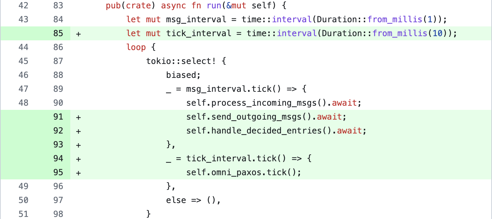
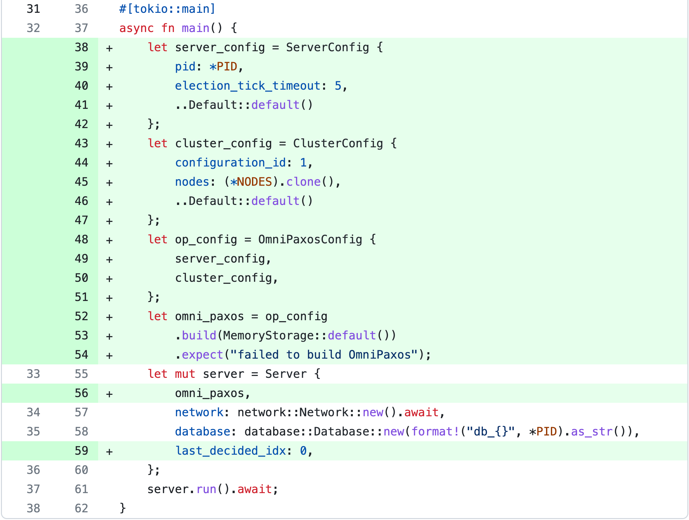

In this post, we will demonstrate how to use OmniPaxos to build a simple distributed database. As seen in the Figure below, we will go from a single-server database service to a distributed setup with multiple servers replicating the database. OmniPaxos will act as the **replicated changelog** for the distributed database that provides a single execution order for all replicas so they remain consistent.


Currently, the client and server are executed in separate docker containers and communicate over [TCP sockets](https://doc.rust-lang.org/std/net/index.html). The client sends a ``KVCommand`` (Put, Get, Delete) to the server, which applies the change to its RocksDB instance and replies to the client.

In the distributed version, servers cannot directly apply a ``KVCommand`` to its database because if servers get clients requests and apply them in different order, the database will become inconsistent across the servers. Instead, a `KVCommand` must first be appended to the `OmniPaxos` log, which will order all requests into a single log and replicate it on all servers. All servers will then continuously read from the `OmniPaxos` log and apply the changes in the same order to remain consistent.

There are three main things to implement:
- [**OmniPaxos as the database changelog**](#omnipaxos-changelog): How to construct and interact with the ``OmniPaxos`` log containing `KVCommand` entries.
- [**Messaging between servers**](#messaging): How to send and handle received ``OmniPaxos`` messages between servers.
- [**Snapshots**](#snapshots): How to compact the ``OmniPaxos`` log to prevent it from growing infinitely.

:tv: **This tutorial is also available on [YouTube](https://youtu.be/4VqB0-KOsms), where we code and show demos after each section.**

## Code Structure
The structure of the source code for the server can be seen below.
```bash
$ tree
.
├── Cargo.lock
├── Cargo.toml
├── Dockerfile
└── src
    ├── database.rs   # wrapper for RocksDB
    ├── kv.rs         # structs for the key-value pairs
    ├── main.rs       # spawns server on tokio thread
    ├── network.rs    # network implementation using TCP sockets
    └── server.rs     # server handling client requests and updating database
```
We will only focus on the code modifications related to OmniPaxos, which will be on those files. If you are interested in more details, the full source code can be found [here](https://github.com/haraldng/omnipaxos-rocksdb-tutorial).

## The OmniPaxos Changelog :clipboard: <a name="omnipaxos-changelog"></a>
We start by adding the required OmniPaxos dependencies to our ``Cargo.toml`` file.


The `serde` feature enables us to simply derive the ser/deserializers for the OmniPaxos messages, while `macros` will also be used to derive implementations required by the library.

The `OmniPaxos` struct is a plain Rust struct and is used for all user interactions, including appending and reading the log. It has two generic parameters `T: Entry` and `S: Storage<T>`. The `T: Entry` is the type of the log entries, which in our case is `KVCommand`. The `S: Storage<T>` is the storage implementation for the log and state of `OmniPaxos`. This can be implemented by the user, but for simplicity, we will use the `MemoryStorage` imported from the `omnipaxos_storage` crate that works out of the box.


We define our `OmniPaxos` struct and use an alias for it (`OmniPaxosKV`):


However, at this point, ``KVCommand`` does not implement the `Entry` trait as required by OmniPaxos. We, therefore, use a macro and derive the implementation for it.


### Server
We now add the ``OmniPaxosKV`` as a field in `Server`. This corresponds to the local version of the replicated changelog at a server. We also add a new field `last_decided_idx` which will help the servers keep track of how far in the log they have read.


### Handling Requests
Since the database will be replicated, the servers cannot directly apply changes to their database when a client request is received. The database can become inconsistent if the servers apply concurrent modifications in different order or if some server fails. Instead, the changes to the database must first be committed in the OmniPaxos log that provides a single order for all servers and guarantee that any committed entry has been replicated on at least a majority of servers.

Thus, when a client tries to modify the database with a `KVCommand::{Put, Delete}` request, the server will first try to `append` it to the `OmniPaxos` log.


A server should continuously look for newly committed entries by checking if the ``decided_idx`` in OmniPaxos has advanced. If so, it will read those entries and apply each of them to its database (line 63--64).


## Messaging :mailbox_with_mail: <a name="messaging"></a>
We have now updated our servers to append client requests to the `OmniPaxos` log and update the database *when* entries have been committed. But to drive the progress and for entries to actually get committed, each server must send out the messages generated by their `OmniPaxos` struct. Thus, we must periodically fetch the outgoing messages from `OmniPaxos` and send them via our network implementation.

We will first add a new message variant for the OmniPaxos messages. As before, we need to define what type of entries the messages will carry, which in this case is `KVCommand`.


In `Server`, we add a new function that takes the outgoing messages using `OmniPaxos::outgoing_messages()` and sends them to the correct server.


The `Message::get_receiver()` returns the `NodeId` of the server that the message should be sent to. In our network implementation here, we map the `NodeId` of each server to their corresponding socket. Note that we don't have to worry about messages getting dropped or delayed; if any messages need to be resent, `OmniPaxos` will produce them for us, and we can send them as usual.

When a ``Server`` receives an OmniPaxos message, it simply needs to be handled by OmniPaxos by calling `handle_incoming()`.


Finally, we update the ``run()`` in `Server` to periodically send outgoing messages and check for any new entries in the OmniPaxos log. We also need to periodically call `tick()` on `OmniPaxos`. This will drive its internal logical clock so that a new leader is elected or any messages are resent if required. That's all the changes required for the server!




The only remaining part is to configure and build ``OmniPaxos`` for each server in `main.rs`. We need to set the `ServerConfig` (specific for every server) and the `ClusterConfig` (same for all servers). The most important fields in the `ServerConfig` are the `pid` (must be unique for each server) and the `election_tick_timeout`. The latter determines how many calls to `tick()` before a server might consider the leader to have failed and try taking over. Here we set it to 5 and call `tick()` every 10ms, corresponding to an election timeout of 50ms.

The `ClusterConfig` has a field `nodes` which should be set to a vector with all servers' `pid` (e.g., `vec![1,2,3]` if we have three servers with id 1,2, and 3).




We can now take our OmniPaxos-powered system for a spin! :dancer:

**Demo** [[**watch**](https://youtu.be/4VqB0-KOsms?t=809) or [**try yourself**](https://github.com/haraldng/omnipaxos-rocksdb-tutorial/tree/omnipaxos-replicated#demo-1-fault-tolerance)]: We kill one of the servers and are still able to access and modify that the database. Furthermore, we also simulate concurrent modifications to show that OmniPaxos provides a single consistent log order at all servers.

## Snapshots :camera: <a name="snapshots"></a>
At this point, we have a simple replicated service where the servers remain consistent by applying changes to the database according to the ``OmniPaxos`` log order. However, over time the log will grow infinitely large. To address this, we will use the *Snapshot* feature in OmniPaxos. We can think of snapshotting as squashing multiple entries into a single entry in the `OmniPaxos` log. An example using `KVCommand` can be seen below.


Instead of storing the first five entries that describe the changes to individual keys, we store one `Snapshot` entry with **the latest value per key**.

To use snapshots, we must create a struct that implements the `omnipaxos::storage::Snapshot` trait. It lets us define how to create a snapshot given a sequence of entries. We will call our snapshot type `KVSnapshot`:


We implement the ``KVSnapshot`` to have a hashmap that contains the latest value per key. To `create()` a snapshot, we iterate through the `entries` of `KVCommand`s and apply them on the hashmap. Handling `KVCommand::Delete` is slightly trickier since the key to be deleted might have been inserted in a previous snapshot from earlier in the log, and therefore does not exist in this current snapshot. If that is the case, we need to keep track of these `deleted_keys` so that when we `merge()` two snapshots, we will remove those deleted keys. The function on line 54 shows how to merge a snapshot with a newer one (`delta`).

Earlier, we derived the ``Entry`` implementation for `KVCommand` using a macro. That macro is used when we don't want to use snapshots. Now that we will use it, we will instead implement `Entry` manually and have `KVSnapshot` as the associated `Snapshot` type.


At this point, we have implemented *how* to create a snapshot, but not *when* to perform it. For instance, we can create a snapshot for every five entries. We update the `handle_decided_entries()` in `Server`:


The ``snapshot()`` function takes two parameters: an optional `compact_idx` that specifies the log index where a snapshot should be created at. If it is `None` then the highest possible log index will be used, which is the `decided_idx`. The second parameter is the `local_only` flag, which determines if only this server or all servers should perform the snapshot. Here, we set the snapshots to be local-only since all servers will try to snapshot once they see 5 new decided entries.

**Demo** [[**watch**](https://youtu.be/4VqB0-KOsms?t=1389) or [**try yourself**](https://github.com/haraldng/omnipaxos-rocksdb-tutorial/tree/omnipaxos-snapshot#demo-2-snapshot)]: We attach to one of the server containers and for every 5th successful request, it outputs how the log is snapshotted.

## Summary
We have successfully turned our single-point-of-failure RocksDB service into a highly available service with multiple replicas! By using OmniPaxos as a changelog, we managed to build a consensus-replicated system without having to deal with the complexities of consensus.

In general, users only need to implement the messaging between servers and how a server should read/write from the replicated log to transform their system into a replicated and fault-tolerant system with OmniPaxos. :rocket:
