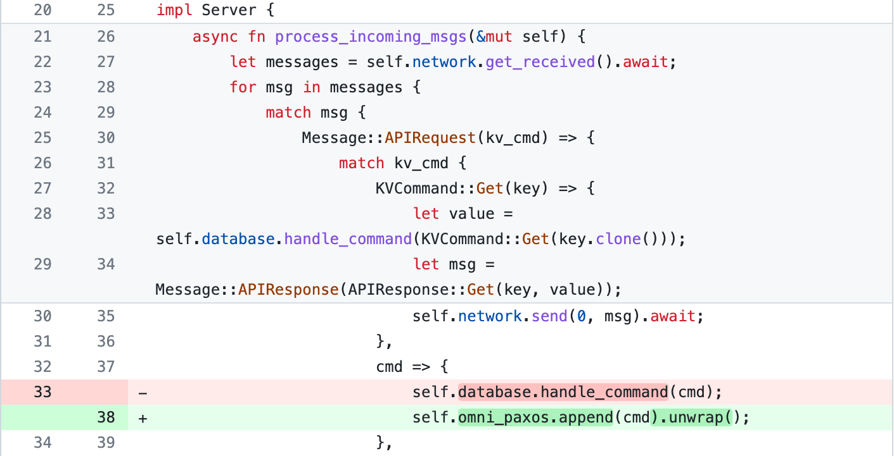

In this post, we will showcase how to build a simple distributed database using OmniPaxos. As seen in the Figure below, we will go from a single server setup to a distributed setup with multiple servers replicating the database. OmniPaxos will act as the replicated changelog of the database.

Currently, the client and server are executed in two docker containers and communicate using [TCP sockets](https://doc.rust-lang.org/std/net/index.html). The client sends a ``KVCommand`` (Put, Get, Delete) to the server which applies the change to its database and replies the client. In the replicated version, the server handling the request will instead first append the `KVCommand` to the `OmniPaxos` log. Then, all servers will continuously read new committed entries from the log and apply them to their database. The `OmniPaxos` log provides a single execution order for all replicas so that they remain consistent. Furthermore, any committed entry will be present on at least a majority of servers to tolerate possible server and network failures.

There are three main things to implement:
- [OmniPaxos as the database changelog](#creating-omnipaxos): How to construct and interact with the ``OmniPaxos`` log containing `KVCommand` entries.
- [Messaging between servers](#messaging): How to send and handle received ``OmniPaxos`` messages between servers.
- (Bonus) [Snapshotting](#snapshotting): How to compact the ``OmniPaxos`` log to prevent it growing indefinitely.

To focus on the relevant parts, we will show the code added or modified related to OmniPaxos. The full source code can be found [TODO]().
## The OmniPaxos Changelog
We begin by adding the required OmniPaxos dependencies to our ``Cargo.toml`` file.

The `serde` feature enables us to simply derive the ser/deserializers for the OmniPaxos messages, while the `macros` feature is also used for deriving implementations required by the library.

The `OmniPaxos` struct is plain Rust `struct`, and is used for all user-interactions including appending and reading from the log. It has two generic parameters `T: Entry` and `S: Storage<T>`. The `T: Entry` is the type of our log entries, which in our case is `KVCommand`. The `S: Storage<T>` is the struct that stores the log and state of `OmniPaxos`. For simplicity, we will use the `MemoryStorage` imported from the `omnipaxos_storage` crate that works out-of-the-box.

However, at this point, ``KVCommand`` does not implement the `Entry` trait as required by OmniPaxos. We will therefore use a macro and derive the implementation for it.

### Server
We now add the ``OmniPaxosKV`` as a field in `Server`. This corresponds to the local version of the replicated changelog at a server. We also add a new field `last_decided_idx` which will help the servers keep track of where it should read from in the log.

### Handling Requests
Since the database will be replicated, the servers cannot just apply changes  directly to their local version of the database when they get a client request. The database can become inconsistent if the servers apply concurrent modifications in different order or if some server fails. Instead, the changes to the database must first be committed in the OmniPaxos log which will provide the single execution order that all servers can safely follow.

Thus, when a client tries to modify the database with a `KVCommand::{Put, Delete}` request, the server will first try to `append` it to the replicated log (line 35).

A server should look for newly committed entries by checking if the ``decided_idx`` has advanced. If so, it will read those entries and apply each of them to the database (via `update_database()`).

## Messaging
We have now updated our servers to append client requests to the `OmniPaxos` log and update the database *when* entries have been committed. But to drive the progress and get entries to actually be committed, each server must send out the messages that get generated by their `OmniPaxos` struct to the other servers. We, as the developer, must therefore periodically fetch the outgoing messages from `OmniPaxos` and send them over our network implementation.

We will first add a new message variant for the OmniPaxos messages. As before, we need to define what type of entries the messages will carry, which in this case is `KVCommand`.

In `Server`, we add a new function that takes the outgoing messages using `OmniPaxos::outgoing_messages()` and sends them to the correct server.

The `Message::get_receiver()` returns the `NodeId` of the server that the message should be sent to. In our network implementation here, we map the `NodeId` (alias for `u64`) of each server to their corresponding socket.

When a ``Server`` receives an OmniPaxos message, it simply needs to pass the message to OmniPaxos by calling `handle_incoming()`.

Finally, we update the ``run()`` in `Server` to periodically send outgoing messages and check for any new entries in the OmniPaxos log. We also need to periodically call `tick()` on OmniPaxos. This will drive the internal logical clock, so that we can elect a new leader or resend any messages if required. That's all the changes required for the server!

The only remaining part is to configure and build the ``OmniPaxos`` for each server in `main.rs`. We need to set the `ServerConfig` (specific for every server) and the `ClusterConfig` (same for all servers). The most important fields in the `ServerConfig` are the `pid` (must be unique for each server) and the `election_tick_timeout`. The latter determines how many calls to `tick()` before a server might consider the leader to have failed and try taking over. Here we set it to `5` and call `tick()` every 10ms which corresponds to an election timeout of 50ms.

The `ClusterConfig` has a field `nodes` which should be set to a vector with all servers' `pid` (e.g., `vec![1,2,3]` if we have three servers with id 1,2, and 3).

We can now take our OmniPaxos-powered system for a spin! :dancer:
TODO link to demo.

## Snapshotting
At this point, we have a simple replicated service where the servers remain consistent by applying changes to the database according to the ``OmniPaxos`` log order. However, over time the log will grow infinitely large. To address this, we will use the *Snapshot* feature in OmniPaxos. We can think of snapshotting as squashing multiple entries into a single entry in the `OmniPaxos` log. An example using `KVCommand` can be seen below.

Instead of storing the first five entries that describe the changes to individual keys, we store one `Snapshot` entry with **the latest value per key**.

To use snapshots, we must create a ``struct`` that implements the `omnipaxos::storage::Snapshot` trait. The trait lets us define how to create a snapshot given a sequence of entries. We will call our snapshots `KVSnapshot`:

The ``KVSnapshot`` has a hashmap with key-value pairs. To `create()` a snapshot, we iterate through the `entries` of `KVCommand`s and apply the operation on the hashmap. Handling `KVCommand::Delete` is slightly trickier, since the key to be deleted might have been inserted in a previous snapshot from earlier in the log, and therefore does not exist in this current snapshot. If that is the case we need to keep track of these `deleted_keys` so that when we `merge()` two snapshots, we will remove those deleted keys. The function on line 56 shows how to merge a snapshot with a newer one (`delta`).

Earlier, we derived the ``Entry`` implementation for `KVCommand` using the macro. That macro is used when we don't want to use snapshots. Now that we will use it, we will instead implement `Entry` manually and have `KVSnapshot` as the associated `Snapshot` type.

At this point, we have implemented *how* to create a snapshot, but not *when* to perform it. For this demo, we can create a snapshot for every five entries. We update the `handle_decided_entries()` in `Server`:

