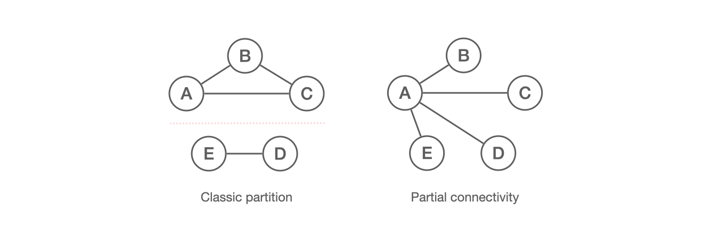
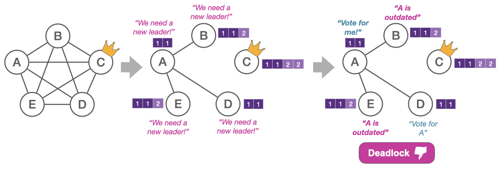

State machine replication (SMR) protocols such as Raft, VR, and MultiPaxos are widely used to build replicated services in the cloud. These protocols depend on a stable leader to make progress. However, as shown by the 6+ hour Cloudflare [outage](https://blog.cloudflare.com/a-byzantine-failure-in-the-real-world/) in 2020, partial connectivity can cause the leader election in these protocols to fail. In a previous [post by Howard and Abraham](https://decentralizedthoughts.github.io/2020-12-12-raft-liveness-full-omission/), they showed how Raft overcomes some partial connectivity scenarios by incorporating new logic into the leader election process. In this post, we will examine the core challenges posed by partial connectivity, generalize them for other protocols, and present a new scenario that Raft cannot handle even with the suggested updates.

## What is partial connectivity?

Partial connectivity refers to a network failure where two servers become disconnected but are still reachable by a third server. Such failures tend to occur due to [network upgrades](https://github.com/elastic/elasticsearch/issues/9495), firewall or network [misconfigurations](https://github.com/elastic/elasticsearch/issues/6105), or [unstable links between switches](https://issues.apache.org/jira/browse/MAPREDUCE-1800).

This situation is distinct from the standard assumption of network partitions, where servers are either part of one partition or another. In partial connectivity, two connected servers may have differing views on the status of their peers. In the partial connectivity example, servers B-E all observe that server A is alive but are unaware of each other’s status. These inconsistent views can lead to serious issues where protocols become unable to progress. Let's examine these issues in three particular scenarios: the quorum-loss scenario, the constrained-election scenario, and the chained scenario.

*Quick recap on Leader Election & Quorums:* Before we analyze the scenarios, let's revisit the concepts of leader election and quorums. In short, consensus protocols are typically leader-based since that provides a simple solution to handle the concurrency from multiple servers proposing at the same time. A dedicated leader handles all proposals and orders them into a log (or sequence). This log defines the single execution order for all servers so that they remain consistent. A log entry must be replicated on a majority of servers before it is committed. This majority is referred to as a "quorum", and is used since any two majorities overlap on at least one server. Thus, if the leader or other servers fail, we can always recover the committed log entries from any majority and maintain safety. *Term* or *Ballot* numbers are identifiers for the different leader epochs and allow servers to compare how updated entries in the log are (higher is more updated).

### Quorum-Loss Scenario

Consider a situation where we initially have 5 servers (A-E) that are fully connected. Server C is initially able to correctly function as the leader since it's connected to a majority quorum. But later, partial connectivity causes it to no longer be connected to a quorum and therefore unable to commit any new entries. At this point, servers B, D, and E detect that they have lost connection to their leader (C). But they are unable to become leaders themselves as they are not connected to a quorum. On the other hand, server A is connected to a quorum and able to potentially function as the leader. However, since A is still connected to its leader C, it does not initiate a new election.

This results in a deadlock for protocols that simply use the alive status of the leader to determine if an election should be initiated (e.g., [MultiPaxos](https://www.cs.cornell.edu/courses/cs7412/2011sp/paxos.pdf)). Viewstamped Replication (VR) will also be deadlocked despite its round-robin election scheme. A server only votes for a leader (view) change if it observes a majority that also wants to do the same. This design originates in the classic assumption we showed earlier, where servers are fully connected within each partition. But here, it results in servers B-E not triggering a leader change as required.

**Key insight:** The leader’s alive status alone is insufficient to determine leader change; the leader must also be quorum-connected. Furthermore, regardless of what a server's connectivity is, it should be able to vote for another server as long as they are connected.

### Constrained-Election Scenario

The constrained-election scenario is similar to the quorum-loss scenario, but the leader (C) is now entirely partitioned from the rest. This time, server A detects the need for a new leader and calls for an election. However, at the time of the network error, servers B and E had a more up-to-date log than A. This poses a problem for protocols like Raft, which require a server to have an up-to-date log to get votes. The network is again in a position where A must become the leader to make progress, but it cannot be elected since B and E will not vote for it due to its outdated log. Again, this results in a deadlock where no capable leader can take over.

The up-to-date log requirement is strictly necessary for the safety of Raft. But here, it causes the progress to be suspended even though there is a server (A) that is still connected to a majority.

**Key insight:** There must be no strict requirements to become a leader besides being quorum-connected.

### Chained Scenario

In the chained scenario, we initially have three fully-connected servers where B is the leader. Then, B and C disconnect, which causes C to believe that B has failed, and try taking over leadership with a higher term number. Server A will adopt C’s higher term number and subsequently reject proposals from B. When A rejects B, it will include the current term number, and B will therefore get to know that it has been overtaken. After a while of not hearing from the new leader C, server B will timeout and the described scenario will reoccur in the reversed direction; B will call for a new election with an even higher term number and regain leadership. This results in a livelock where the leader repeatedly changes. The servers have inconsistent views on who is alive and trigger new terms as soon as the leader is suspected to have failed.

**Key insight:** Gossiping the identity of the current leader can cause liveness issues if servers have inconsistent views on who is alive.

## How OmniPaxos Addresses These Scenarios
The table below summarizes the most widely-used protocols and how they behave in the described scenarios (for more a detailed explanation, see our EuroSys'23 paper).

As we see, there is no protocol other than OmniPaxos that can overcome all these scenarios. The novelty of OmniPaxos lies in eliminating all unnecessary restrictions imposed on candidate servers, and instead focusing on the only relevant requirement for becoming the leader, which is to be **quorum-connected (QC)**. Therefore, unlike other protocols, OmniPaxos ignores the connectivity of non-candidates, omits gossiping the identity of the current leader, and completely separates the logic and state for leader election (liveness) from replication (safety). Instead, it uses an implicit form of voting where servers only exchange their connectivity status and ballot number, and do not publicly announce which leader they vote for. If a server is QC and has the highest ballot number, it will prevail as the leader in the replication protocol and manage to commit new entries.

Ballot Leader Election (BLE) is the leader election protocol in OmniPaxos and it provides resilience against partial connectivity by guaranteeing the election of a leader that can make progress, as long as such a candidate exists. In BLE, all servers periodically exchange heartbeats with one another. The heartbeats allow servers to know which of their peers are alive, but more importantly, if they are quorum-connected. Each server includes its ballot number and a flag indicating its QC status in the heartbeats. This allows servers to detect when the leader fails or loses its quorum-connectivity. A server attempts to overtake leadership by incrementing their ballot number. But this can only be done if the server is QC, which ensures that only capable servers (i.e., QC servers) can be elected.

### OmniPaxos in the Quorum-Loss Scenario

The heartbeats sent by C will indicate that it has lost its QC stauts. Server A will therefore correctly identify the need for a new leader despite still being connected to C. Since A is still QC, it will increment its ballot number and successfully become the new leader.

### OmniPaxos in the Constrained-Election Scenario

In this scenario, all the follower servers become disconnected from the leader. Since A is the only QC server, it will be the only one that increments its ballot number and attempt to become the leader. Server A will win the election because BLE doesn’t require it to have an up-to-date log to become a leader. Moreover, servers B, D, and E do not need to be connected to a majority to start following it. Thus, A overtakes leadership and synchronizes with its followers to become up-to-date before serving new requests. The synchronization occurs in the replication logic, completely separated from the BLE protocol.

### OmniPaxos in the Chained Scenario

In the chained scenario, C will once again think that B has failed, and since it is QC, it will increment its ballot number to try take over. Server A will start following C with the higher ballot. This time, however, the election of C is not gossiped to server B. This is because the heartbeats that A sends only include its own ballot number and  QC status, but not the ballot of its leader. Server B will not see that C has been elected and therefore not interrupt the stability of C’s leadership. Instead, servers A and C can continue to make progress as a quorum.

### Conclusion

The heartbeats of OmniPaxos’ BLE protocol includes only the essential information for electing a leader, namely the quorum-connected status (QC) and the ballot number of a server. This enables capable QC servers to step up as the leader when required. Furthermore, as leader election is separated from replication, non-QC server can still participate in the replication to help QC servers form a quorum that commits entries. This enables OmniPaxos to fully leverage the power of leader-based consensus. That is, OmniPaxos requires only a single server to be connected to a majority to make progress, instead of the fully-connected majority required by other existing protocols.
