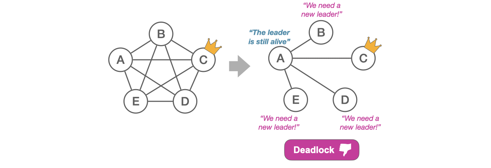

State machine replication (SMR) protocols such as Raft, VR, and MultiPaxos are widely used to build replicated services in the cloud. These protocols depend on a stable leader to make progress. However, as shown by the 6+ hour Cloudflare [outage](https://blog.cloudflare.com/a-byzantine-failure-in-the-real-world/) in 2020, partial connectivity can cause the leader election in these protocols to fail. In this post, we will explore what partial connectivity is, why existing algorithms fail under such conditions, and how OmniPaxos addresses this issue.

## What is partial connectivity?

Partial connectivity refers to a network failure where two servers become disconnected but both can still be reached by a third server. Such failures tend to occur due to [network upgrades](https://github.com/elastic/elasticsearch/issues/9495), firewall or network [misconfigurations](https://github.com/elastic/elasticsearch/issues/6105), or [unstable links between switches](https://issues.apache.org/jira/browse/MAPREDUCE-1800).

This situation is distinct from the standard assumption of network partitions, where servers are either part of one partition or another. In partial connectivity, two connected servers may have differing views on the status of their peers. In the partial connectivity example, servers B-E all observe that server A is alive but are unaware of each other’s status. These inconsistent views can lead to serious issues where protocols become unable to progress. Let's examine these issues in three particular scenarios: the quorum-loss scenario, the constrained-election scenario, and the chained scenario.

### Quorum-Loss Scenario

Consider a situation where we initially have 5 servers (A-E) that are fully-connected. Server C is initially able to correctly function as the leader since it's connected to a majority quorum. But later, partial connectivity causes it to no longer be connected to a quorum and therefore unable to commit any new entries. At this point, servers B, D, and E detect that they have lost connection to their leader C but are unable to become leaders themselves as they are not connected to a quorum. On the other hand, server A is connected to a quorum and able to function as the leader. However, since A is still connected to its leader C, it does not initiate a new election to become the leader.

This results in a deadlock for protocols such as Raft and MultiPaxos where servers use the alive status of the leader to determine if an election should be initiated. Viewstamped Replication (VR) will also be deadlocked despite its round-robin election scheme. A server only votes for a leader (view) change if it observes a majority that also wants to do the same. This design originates in the classic assumption we showed earlier, where servers are fully connected within each partition. But here, it results in servers B-E not voting for a leader change as required.

**Key insight:** The leader’s alive-status alone is insufficient to determine leader change; the leader must also be quorum-connected. Furthermore, servers should be able to vote for another server as long as they are connected.

### Constrained-Election Scenario

The constrained-election scenario is similar to the quorum-loss scenario, but the leader C is now entirely partitioned from the rest. This time, server A detects the need for a new leader and calls for an election. However, at the time of the network error, servers B and E had a more up-to-date log than A. This poses a problem for protocols like Raft, which require a server to have an up-to-date log to get votes. The network is again in a position where A must become the leader to make progress, but it cannot be elected due to its outdated log. Again, this results in a deadlock where no capable leader can take over.

**Key insight:** There must be no strict requirements to become a leader besides being quorum-connected.

### Chained Scenario

In the chained scenario, we initially have three fully-connected servers where B is the leader. B and C disconnect causing C, believing B has failed, to try and take over leadership with a higher term number. Server A will adopt C’s higher term number and subsequently reject proposals from B. When A rejects B, it will include the current term number, and B will therefore get to know that it has been overtaken. After a while of not hearing from the new leader C, server B will timeout and the described scenario will reoccur in the reversed direction; B will call for a new election with an even higher term number and regain leadership. This results in a livelock where the leader repeatedly changes. The servers have inconsistent views on who is alive and trigger new terms as soon as the leader is suspected to have failed.

**Key insight:** Gossiping the identity of the current leader can cause liveness issues if servers have inconsistent views on who is alive.

## How OmniPaxos Addresses These Scenarios

OmniPaxos is the only SMR protocol that addresses all these scenarios. OmniPaxos incorporates the novel concept of quorum-connectivity into the leader election process, which helps to address the three key insights gained from the different scenarios. Furthermore, Omni-Paxos also completely separates the logic and state for leader election (liveness) from consensus (safety). In this way, it lowers the minimal requirements for the protocol to provide liveness which addresses the partial connectivity issues.

Ballot Leader Election (BLE) is the leader election protocol in OmniPaxos and it provides resilience against partial connectivity by guaranteeing the election of a leader that can make progress, as long as such a candidate exists. In BLE, all servers periodically exchange heartbeats with one another. The heartbeats allow servers to know which of their peers are alive, but more importantly, if they are **quorum-connected (QC)**. Each server include their ballot number and a flag indicating their QC status in the heartbeats. This allows servers to detect when the leader fails or loses its quorum-connectivity. Furthermore, it allows only capable servers (i.e., QC servers) to attempt an election and possibly be elected.

### OmniPaxos in the Quorum-Loss Scenario

Due to the quorum-connected status flag, server A correctly identifies the need for a new leader despite still being connected to C. Server A then calls for a new election and, as it is the only quorum-connected server, wins.

### OmniPaxos in the Constrained-Election Scenario

In this scenario, all the follower servers become disconnected from the leader. Since A is the only QC server, it will be the only one that increments its ballot number and attempt to become the leader. Server A will win the election because BLE doesn’t require it to have an up-to-date log to become a leader. Moreover, servers B, E, D do not need to be connected to a majority to vote for it. Server A is elected and then syncs with its followers to become up-to-date before serving new requests.

### OmniPaxos in the Chained Scenario

In the chained scenario, once again C detects the need for a new leader and, together with A’s vote, becomes the next leader. This time, however, the election of C is not gossiped to server B. This is because the heartbeats that A sends only includes its own ballot number and NOT the ballot of its leader. Server B will not see that C has been elected and therefore not interrupt the stability of C’s leadership. Instead, servers A and C can continue to make progress as a quorum.

### Conclusion

The quorum-connected heartbeats of OmniPaxos’ BLE protocol allow it to overcome partial connectivity scenarios where other protocols fail. These heartbeats allow servers to determine their leader without being quorum connected themselves. This enables OmniPaxos to fully leverage the power of leader-based consensus. That is, OmniPaxos only requires one server connected to a majority to make progress, instead of a fully-connected majority required by other existing protocols.
